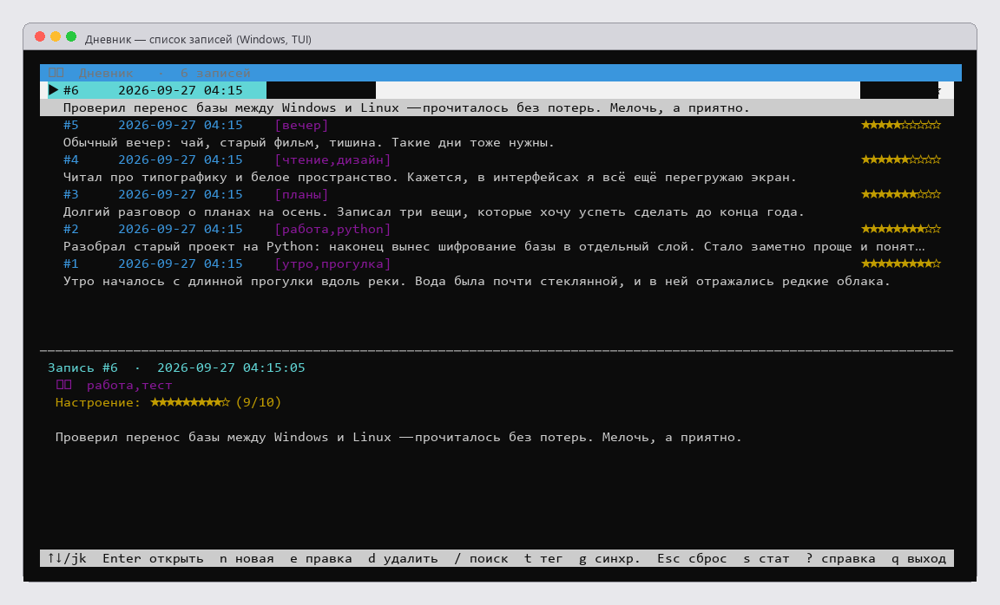
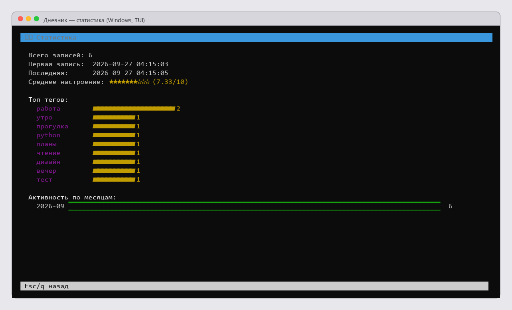
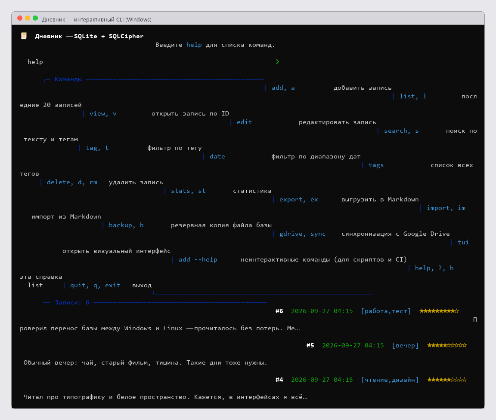
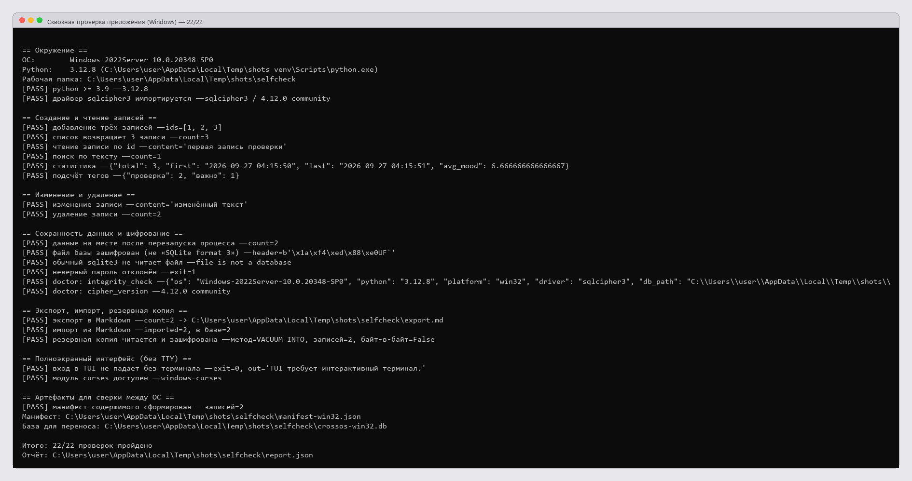

# 📔 Дневник — личный дневник на зашифрованном SQLite

Офлайн-дневник с тегами, настроением, поиском, статистикой, экспортом в Markdown и
необязательной синхронизацией с Google Drive. Все записи лежат в **зашифрованной**
базе SQLite (SQLCipher) — пароль спрашивается при каждом запуске и нигде не хранится.

**Работает и на Windows, и на Linux**: один и тот же код, готовые колёса зависимостей
для обеих систем, база переносится между системами обычным копированием файла.

```
Python 3.9+   ·   SQLCipher 4.12   ·   интерфейс: CLI + полноэкранный TUI
Готовые сборки для Windows и Linux — в разделе Releases
```



---

## Возможности

* **Зашифрованная база** — SQLCipher 4 (AES-256, OpenSSL), без пароля файл не читается.
  Обычный `sqlite3` его тоже не откроет.
* **Полноэкранный интерфейс** — список, карточка записи, статистика, поиск, фильтр по тегу.
* **Интерактивный CLI** — для тех, кто любит команды.
* **Неинтерактивный режим** — те же операции одной строкой, с выводом в JSON: удобно
  для скриптов, бэкапов и CI.
* **Теги и настроение** — фильтры по тегу и диапазону дат, статистика и топ тегов.
* **Экспорт и импорт Markdown**, резервные копии базы.
* **Google Drive** (необязательно) — загрузка и скачивание файла базы.

## Скриншоты

| Список записей | Статистика |
|---|---|
|  |  |

| Интерактивный CLI | Сквозная проверка на Windows |
|---|---|
|  |  |

Все кадры сняты с реального запуска приложения: вывод интерпретируется эмулятором
терминала и рисуется по клеткам, ничего не дорисовывается вручную.

Дополнительно: [карточка записи](docs/screenshots/tui-view.png) и
[отчёт о совместимости Windows/Linux](docs/compatibility-report.html).

---

## Быстрый старт

### Windows

```powershell
git clone https://github.com/larin-ilya/diary.git
cd diary
powershell -ExecutionPolicy Bypass -File .\install.ps1
.\run.ps1              # обычный дневник
.\run.ps1 tui          # полноэкранный интерфейс
```

### Linux

```bash
git clone https://github.com/larin-ilya/diary.git
cd diary
bash ./install.sh
./run.sh               # обычный дневник
./run.sh tui           # полноэкранный интерфейс
```

Установщик сам находит Python 3.9+, создаёт рядом папку `.venv` и ставит зависимости.
Компилятор и SQLCipher SDK не нужны — всё приходит готовыми колёсами.

### Из готовой сборки (без Python)

Скачайте архив для своей системы на странице **Releases** и распакуйте:

| Система | Файл | Что делать |
|---|---|---|
| Windows 10/11 x64 | `diary-windows-x64.zip` | распаковать и запустить `diary.exe` |
| Linux x64 (свежий) | `diary-linux-x64.tar.gz` | распаковать и запустить `./diary` |
| Из исходников | `Source code (zip)` на той же странице | как в «Быстром старте» выше, нужен Python 3.9+ |

Сборки не требуют установленного Python. База данных всё равно лежит в домашней
папке пользователя, рядом с исполняемым файлом ничего не создаётся.

> **Про Linux-сборку.** Она собрана с CPython 3.13 и требует **glibc ≥ 2.38**
> (Ubuntu 23.10+, Debian 13, Fedora 39+, RHEL 10+). На более старых дистрибутивах
> используйте установку из исходников через `./install.sh` — этот способ
> поддерживается на любом Python 3.9+.

Проверка целостности скачанного файла — в описании релиза указаны контрольные
суммы SHA-256.

---

## Где лежит база данных

| Что | Путь |
|---|---|
| По умолчанию (Windows) | `%USERPROFILE%\.diary.db` |
| По умолчанию (Linux) | `~/.diary.db` |
| Свой путь | переменная окружения `DIARY_DB` |
| Пароль без запроса | переменная окружения `DIARY_PASSWORD` |
| Ключ Google Drive | `client_secret.json` рядом с `TUI.py` |

```powershell
$env:DIARY_DB = "D:\diary\my.db"; .\run.ps1
```
```bash
DIARY_DB="$HOME/diary/my.db" ./run.sh
```

Пароль **никуда не сохраняется**. Забыли пароль — данные восстановить нельзя,
поэтому держите его в менеджере паролей.

## Перенос базы между Windows и Linux

База — это один обычный файл, поэтому перенос сводится к копированию: ничего
конвертировать не нужно.

```bash
./run.sh backup diary-backup.db            # Linux: копия перед переносом
```
```powershell
.\run.ps1 backup diary-backup.db           # Windows
```

Скопируйте файл на другую систему, положите в нужное место и проверьте:

```powershell
Copy-Item .\diary-backup.db "$env:USERPROFILE\.diary.db"
.\run.ps1 doctor        # версия SQLCipher, integrity_check, число записей
```

Автоматическая сверка содержимого между системами:

```bash
python scripts/selfcheck.py --workdir transfer          # на исходной системе
# перенести папку transfer на другую систему, затем там:
python scripts/compare_dbs.py --db transfer/crossos-linux.db \
                              --manifest transfer/manifest-linux.json
```

---

## Команды

### Интерактивный режим

`add` `list` `view` `edit` `search` `tag` `date` `tags` `delete` `stats`
`export` `import` `backup` `gdrive` `tui` `help` `quit`

### Полноэкранный интерфейс (`run.ps1 tui` / `./run.sh tui`)

`↑↓` / `j k` — навигация, `Enter` — открыть, `n` — новая, `e` — правка,
`d` — удалить, `/` — поиск, `t` — фильтр по тегу, `g` — синхронизация,
`r` — обновить, `s` — статистика, `?` — справка, `q` — выход.

На Windows правка открывается в `notepad`, на Linux — в `nano`
(переопределяется переменной `EDITOR`).

### Неинтерактивный режим

```bash
python TUI.py add --content "Текст записи" --tags "работа,итоги" --mood 8
python TUI.py list --limit 10 --json
python TUI.py view 3 --json
python TUI.py search "итоги" --json
python TUI.py stats --json
python TUI.py tags --json
python TUI.py delete 3
python TUI.py export export.md
python TUI.py import export.md
python TUI.py backup backup.db
python TUI.py doctor --json
```

Общие ключи (до команды): `--db <путь>`, `--password ***`, `--json`.

---

## Тесты и CI

```bash
python -m pip install -r requirements-dev.txt
python -m pytest -q                    # 34 теста: шифрование, CRUD, персистентность
python scripts/selfcheck.py            # 22 сквозные проверки настоящими процессами
```

GitHub Actions (`.github/workflows/ci.yml`) гоняет и то, и другое на матрице
`ubuntu-latest` + `windows-latest` × Python 3.10 / 3.11 / 3.12.

## Технические решения

Драйвер шифрованной SQLite — **[`sqlcipher3`](https://pypi.org/project/sqlcipher3/)
0.6.2**: у него готовые колеса и для Windows (`win_amd64`), и для Linux
(`manylinux`/`musllinux`). Устаревший `sqlcipher3-binary` колёс под Windows не
имеет и там просто не устанавливается — из-за него приложение раньше и падало.
Формат базы у обоих пакетов одинаковый, поэтому миграция не требуется.

Если база создавалась старой SQLCipher 3.x, приложение само пробует открыть её
в режиме совместимости. Подробности — в
[REPORT_COMPATIBILITY.md](REPORT_COMPATIBILITY.md).

## Диагностика

```bash
./run.sh doctor --json
```

| Симптом | Что делать |
|---|---|
| `No matching distribution found for sqlcipher3-binary` | ставите старый requirements; нужен `sqlcipher3==0.6.2` |
| `Неверный пароль или база повреждена` | проверьте пароль; для баз SQLCipher 3.x приложение само включит режим совместимости |
| `Не найден модуль curses` | `python -m pip install windows-curses` |
| `TUI требует интерактивный терминал` | TUI запускается только из настоящего терминала, не из пайпа |

## Структура

```
diary/
├── TUI.py                       # приложение: CLI + TUI + неинтерактивные команды
├── TUI.py.orig                  # версия до правок (для отката)
├── requirements.txt             # sqlcipher3, windows-curses (маркер win32), Google API
├── install.ps1 / run.ps1        # установка и запуск на Windows
├── install.sh  / run.sh         # установка и запуск на Linux
├── tests/                       # pytest
├── scripts/selfcheck.py         # сквозная проверка на текущей системе
├── scripts/compare_dbs.py       # сверка базы с манифестом другой системы
├── docs/screenshots/            # скриншоты для README
├── docs/compatibility-report.html
├── .github/workflows/ci.yml     # CI: Windows + Linux
├── REPORT_COMPATIBILITY.md      # разбор проблемы и решения
└── .gitignore                   # база, ключи и токены в репозиторий не попадают
```

---

Личный проект. Ключи Google и файлы баз в репозиторий не добавляются — они
перечислены в `.gitignore`.
