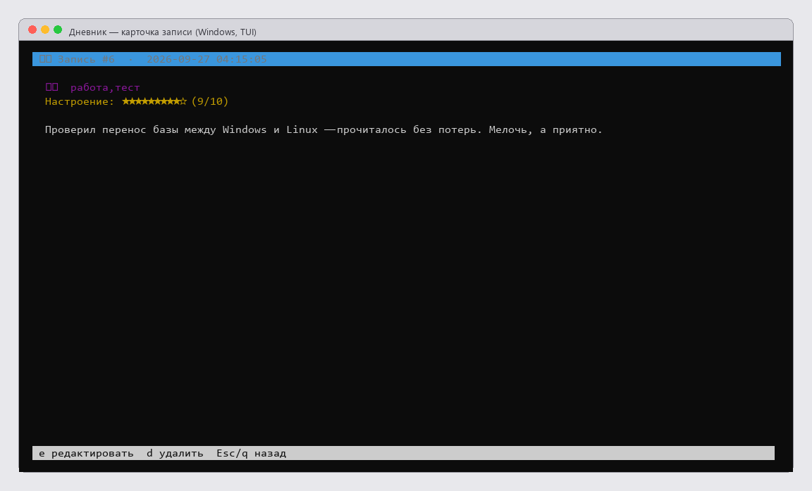

# 📔 Дневник

Личный офлайн-дневник: записи, теги, настроение, поиск и статистика. Всё хранится
в одном зашифрованном файле SQLite (SQLCipher) на вашем компьютере — без аккаунтов,
серверов и облаков.

Работает на **Windows и Linux**: один и тот же код и одна и та же база. Можно писать
дома за Windows, а продолжить на ноутбуке с Linux — достаточно скопировать файл.


| Статистика | Карточка записи |
|---|---|
|  |  |

---

## Возможности

### Записи

* добавление, редактирование и удаление записей;
* многострочный текст с любым форматированием — от короткой заметки до длинной записи;
* **теги** — сколько нужно, через запятую, с фильтрацией по ним;
* **настроение** — оценка от 1 до 10, видна в списке шкалой;
* для каждой записи хранятся дата создания и дата последнего изменения.

### Поиск и навигация

* поиск по тексту и по тегам одновременно;
* фильтр по тегу и по диапазону дат;
* список отсортирован по дате, свежие записи сверху;
* в полноэкранном режиме — предпросмотр выбранной записи рядом со списком.

### Статистика

* сколько всего записей и когда они начаты и обновлены;
* среднее настроение за всё время;
* топ тегов с наглядными полосами;
* активность по месяцам — видно, когда вы писали чаще.

### Данные и приватность

* база — обычный файл, но **зашифрованный**: без пароля его не откроет ни дневник,
  ни `sqlite3`, ни любой другой SQLite-клиент;
* пароль вводится при каждом запуске и нигде не сохраняется;
* экспорт всех записей в один файл Markdown и импорт обратно;
* резервная копия базы одной командой;
* необязательная синхронизация файла базы с Google Drive.

### Три способа работы

* **Полноэкранный интерфейс** — список, карточка записи, статистика, поиск и теги
  в одном окне, управление с клавиатуры;
* **Интерактивный CLI** — те же действия командами: `add`, `list`, `edit`, `search`,
  `stats`, `export` и другие;
* **Неинтерактивный режим** — каждая операция одной строкой, с выводом в JSON: удобно
  для скриптов, автобэкапов и автоматизации.

---

## Установка

### Windows

```powershell
git clone https://github.com/larin-ilya/diary.git
cd diary
powershell -ExecutionPolicy Bypass -File .\install.ps1
```

### Linux

```bash
git clone https://github.com/larin-ilya/diary.git
cd diary
bash ./install.sh
```

Установщик находит Python 3.9+, создаёт рядом папку `.venv` и ставит зависимости.
Компилятор и SQLCipher SDK не нужны.

### Готовая сборка (без Python)

На странице [Releases](https://github.com/larin-ilya/diary/releases) лежат архивы
с самостоятельными исполняемыми файлами:

| Система | Файл | Запуск |
|---|---|---|
| Windows 10/11 x64 | `diary-windows-x64.zip` | `diary.exe` |
| Linux x64 | `diary-linux-x64.tar.gz` | `./diary` |

Внутри каждого архива — короткая инструкция «КАК-ЗАПУСТИТЬ». Python не требуется.

## Запуск

```powershell
.\run.ps1              # обычный дневник
.\run.ps1 tui          # полноэкранный режим
.\run.ps1 doctor       # диагностика базы
```
```bash
./run.sh               # обычный дневник
./run.sh tui           # полноэкранный режим
./run.sh doctor        # диагностика базы
```

В полноэкранном режиме: `↑↓` или `j k` — навигация, `Enter` — открыть запись,
`n` — новая, `e` — править, `d` — удалить, `/` — поиск, `t` — фильтр по тегу,
`s` — статистика, `g` — синхронизация, `r` — обновить, `?` — справка, `q` — выход.

Текст записи набирается во внешнем редакторе: на Windows это `notepad`, на Linux
`nano`. Любой другой задаётся переменной `EDITOR`.

## Команды без интерактива

```bash
python TUI.py add --content "Текст записи" --tags "работа,итоги" --mood 8
python TUI.py list --limit 10 --json
python TUI.py view 3 --json
python TUI.py search "итоги" --json
python TUI.py stats --json
python TUI.py tags --json
python TUI.py delete 3
python TUI.py export export.md
python TUI.py import export.md
python TUI.py backup backup.db
python TUI.py doctor --json
python TUI.py --help
```

Общие ключи указываются до команды: `--db <путь>`, `--password ***`, `--json`.

---

## База данных

| Что | Где |
|---|---|
| По умолчанию (Windows) | `%USERPROFILE%\.diary.db` |
| По умолчанию (Linux) | `~/.diary.db` |
| Свой путь | переменная окружения `DIARY_DB` |
| Пароль без запроса | переменная окружения `DIARY_PASSWORD` |
| Ключ Google Drive | `client_secret.json` рядом с приложением |

```powershell
$env:DIARY_DB = "D:\diary\my.db"; .\run.ps1
```
```bash
DIARY_DB="$HOME/diary/my.db" ./run.sh
```

Пароль нигде не хранится — держите его в менеджере паролей. Без пароля данные
восстановить нельзя.

## Перенос между Windows и Linux

База — это один файл, поэтому перенос сводится к копированию: ничего конвертировать
не нужно.

```bash
./run.sh backup diary-backup.db      # копия перед переносом
```
```powershell
.\run.ps1 backup diary-backup.db
```

Скопируйте файл на другую систему, положите по нужному пути и проверьте:

```powershell
Copy-Item .\diary-backup.db "$env:USERPROFILE\.diary.db"
.\run.ps1 doctor      # покажет число записей и результат проверки целостности
```

Сверить содержимое автоматически, запись за записью:

```bash
python scripts/selfcheck.py --workdir transfer          # на исходной системе
python scripts/compare_dbs.py --db transfer/crossos-linux.db \
                              --manifest transfer/manifest-linux.json
```

## Google Drive

Необязательно. Положите `client_secret.json` из Google Cloud Console рядом с
приложением и вызовите `gdrive` в CLI или нажмите `g` в полноэкранном режиме.
Дневник загрузит файл базы на Диск или скачает его (с резервной копией локального
файла перед перезаписью).

## Требования

| | |
|---|---|
| Windows | 10/11 x64 |
| Linux | x86_64 |
| Python (при установке из исходников) | 3.9 и новее |
| Для готовой Linux-сборки | glibc 2.38 и новее (Ubuntu 23.10+, Debian 13, Fedora 39+) |

На старых дистрибутивах Linux используйте установку из исходников — она работает
на любом Python 3.9+.

## Если что-то не работает

```bash
./run.sh doctor --json
```

| Симптом | Причина и решение |
|---|---|
| `Неверный пароль или база повреждена` | пароль введён с ошибкой; для баз SQLCipher 3.x приложение само включает режим совместимости |
| `Не найден модуль curses` | `python -m pip install windows-curses` |
| `TUI требует интерактивный терминал` | полноэкранный режим запускается только из настоящего терминала, не из пайпа |
| Рамки и эмодзи отображаются некорректно | используйте Windows Terminal; в старом `cmd.exe` поможет `chcp 65001` |
| `No matching distribution found for sqlcipher3-binary` | в зависимостях устаревший пакет; нужен `sqlcipher3==0.6.2` из `requirements.txt` |

## Разработка

```bash
python -m pip install -r requirements-dev.txt
python -m pytest -q                    # автотесты: шифрование, CRUD, персистентность
python scripts/selfcheck.py            # сквозная проверка ключевых сценариев
```

CI на GitHub Actions прогоняет и тесты, и сквозную проверку на матрице
`ubuntu-latest` + `windows-latest` × Python 3.10 / 3.11 / 3.12.

## Структура

```
diary/
├── TUI.py                       # приложение: CLI, полноэкранный режим, JSON-команды
├── requirements.txt             # зависимости (sqlcipher3, windows-curses, Google API)
├── install.ps1 / run.ps1        # установка и запуск на Windows
├── install.sh  / run.sh         # установка и запуск на Linux
├── tests/                       # pytest
├── scripts/selfcheck.py         # сквозная проверка на текущей системе
├── scripts/compare_dbs.py       # сверка базы с манифестом другой системы
├── docs/screenshots/            # скриншоты
├── docs/compatibility-report.html
└── .github/workflows/ci.yml     # CI: Windows + Linux
```

---

Личный проект. База данных и ключи Google в репозиторий не добавляются — они
перечислены в `.gitignore`.
